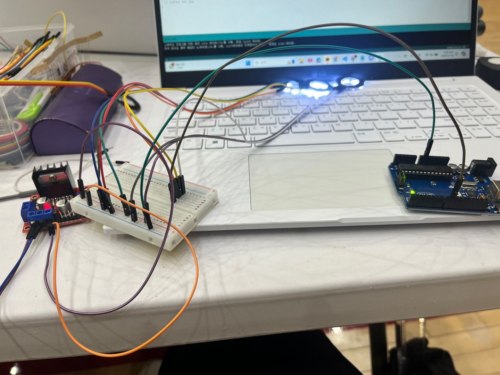
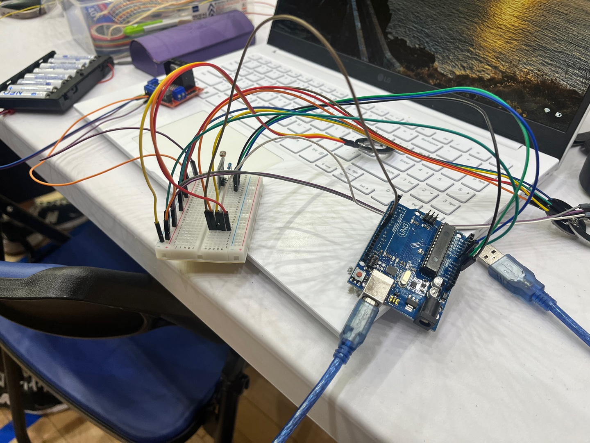

# LookHere_HW
## 🤳🏻 ai 기반 사용자 맞춤 네컷 사진 서비스

### 프로젝트 소개
- **사용자 맞춤 AI 네컷사진 부스**는 키워드를 기반으로 맞춤 **포즈를 추천**하고, **자동 조명 조절 기능**으로 최적의 촬영 환경을 제공합니다. QR 코드로 디지털 형식의 사진을 저장할 수 있어, 물리적 보관의 번거로움을 줄이고, 사용자에게 독특하고 편리한 사진 촬영 경험을 제공합니다.  

- 사용자의 날마다 다른 옷에 따른 밝기를 조도 센서가 감지하고 밝기에 따른 네오 픽셀 조명의 밝기를 정하여 보다 더 나은 촬영 환경을 만들어줍니다.

### 기술스택
- 8개 LED 링 네오픽셀의 전체를 다 켜서 흰색 빛이 나오게 하려면 5V 전원 필요
- 따라서 L298N 모터 드라이버를 사용하여 외부전압 12V를 4개의 네오픽셀로 병렬 연결
- 아두이노 우노의 데이터 핀을 브레드보드로 확장 연결하여 조도센서와 네오픽셀을 제어

### 실제 구현 사진

### 실제 부스 운영 사진

